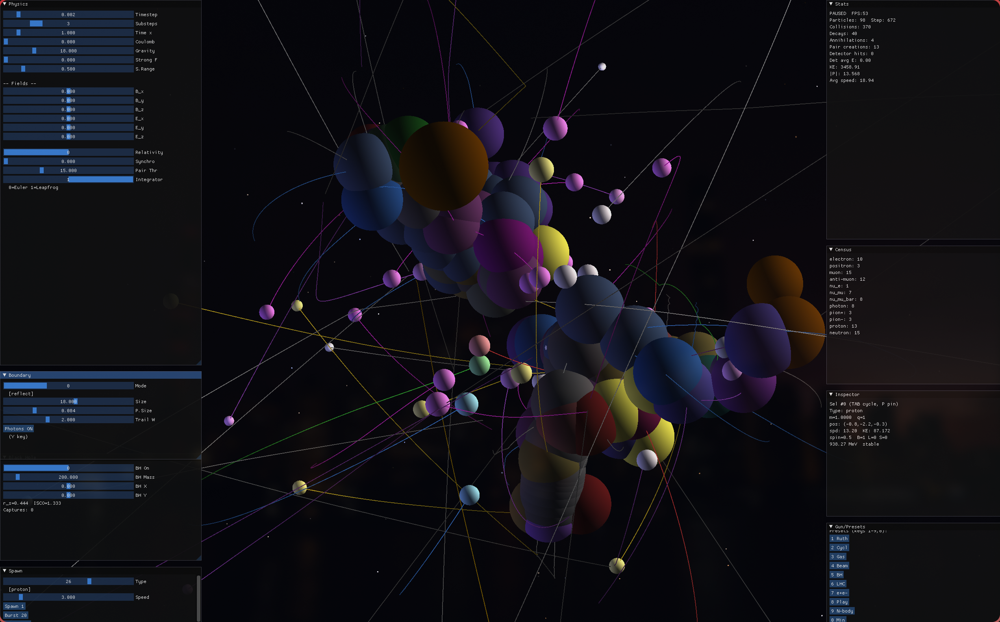

================================================================================
                    Quantum Collider Sandbox
================================================================================

Real-Time GPU Particle Physics Simulation with PDG-accurate particle catalog.
40 observable particles, real masses, lifetimes, decay channels, and proper
relativistic kinematics.

--------------------------------------------------------------------------------
Quick Start
--------------------------------------------------------------------------------

**Clone and run in four steps:**

.. code-block:: bash

   git clone https://github.com/ml3m/quantum-collider-sandbox.git
   cd quantum-collider-sandbox
   python -m venv .venv && source .venv/bin/activate   # Linux/macOS
   make install && make run

On Windows, activate with ``.venv\Scripts\activate`` instead.

--------------------------------------------------------------------------------
Requirements
--------------------------------------------------------------------------------

**System**

-  **Python** 3.10 to 3.12 (3.12.2 recommended)
-  **GPU** with Vulkan support (NVIDIA, AMD, Intel)
-  **Vulkan drivers** installed and working

**Python dependencies** (installed via ``make install``):

-  numpy ≥ 1.24
-  scipy ≥ 1.10
-  taichi ≥ 1.7.0
-  h5py ≥ 3.8

--------------------------------------------------------------------------------
Installation
--------------------------------------------------------------------------------

1. **Clone the repository**

   .. code-block:: bash

      git clone https://github.com/ml3m/quantum-collider-sandbox.git
      cd quantum-collider-sandbox

2. **Create and activate a virtual environment** (recommended)

   .. code-block:: bash

      python -m venv .venv
      source .venv/bin/activate          # Linux / macOS
      # .venv\Scripts\activate           # Windows

3. **Install the package in editable mode with dev tools**

   .. code-block:: bash

      make install

   Or manually:

   .. code-block:: bash

      pip install -e ".[dev]"

4. **Run the simulation**

   .. code-block:: bash

      make run

--------------------------------------------------------------------------------
Makefile Targets
--------------------------------------------------------------------------------

.. list-table::
   :header-rows: 1
   :widths: 12 50

   * - Target
     - Description
   * - run
     - Start the particle physics simulation
   * - install
     - Install package in editable mode with dev dependencies
   * - lint
     - Run pylint on the source code
   * - test
     - Run pytest test suite
   * - test-cov
     - Run pytest with coverage report
   * - format-check
     - Check code formatting (ruff + black)
   * - format
     - Auto-fix formatting (ruff + black)

--------------------------------------------------------------------------------
Command-Line Usage
--------------------------------------------------------------------------------

.. code-block:: bash

   make run                              # Default demo
   python -m quantum_collider_sandbox --particles 100    # Start with N random particles
   python -m quantum_collider_sandbox --data event.h5    # Load from HDF5 file
   python -m quantum_collider_sandbox --log-physics      # Log physics to data/logs/

--------------------------------------------------------------------------------
Keyboard Controls
--------------------------------------------------------------------------------

.. list-table::
   :header-rows: 1
   :widths: 8 40

   * - Key
     - Action
   * - SPACE
     - Pause / Resume
   * - R
     - Reset to demo state
   * - C
     - Spawn proton–antiproton collision
   * - T
     - Toggle trails
   * - F
     - Toggle collision flashes
   * - Y
     - Toggle photon visibility
   * - E
     - Export state and time series to HDF5
   * - B
     - Toggle black hole
   * - G
     - Toggle particle gun
   * - TAB
     - Cycle inspector to next particle
   * - P
     - Pin / freeze selected particle
   * - 1–9
     - Presets (Rutherford, cyclotron, LHC, …)
   * - RMB
     - Orbit camera (drag)
   * - Scroll
     - Zoom
   * - ESC
     - Quit

--------------------------------------------------------------------------------
Vulkan / GPU Troubleshooting
--------------------------------------------------------------------------------

The simulation uses Taichi with the Vulkan backend. If you see Vulkan-related
errors:

-  **NVIDIA**: Install the latest proprietary drivers; Vulkan is usually included.
-  **AMD**: Use Mesa (Linux) or AMD Adrenalin (Windows) with Vulkan support.
-  **Intel**: Ensure Mesa or Intel drivers with Vulkan are installed.

Verify Vulkan with:

.. code-block:: bash

   vulkaninfo

If Vulkan is unavailable, use the ``QUANTUM_COLLIDER_ARCH`` environment variable::

   QUANTUM_COLLIDER_ARCH=cpu python -m quantum_collider_sandbox   # CPU fallback
   QUANTUM_COLLIDER_ARCH=gpu python -m quantum_collider_sandbox    # Auto-detect GPU

Supported values: ``vulkan`` (default), ``cuda``, ``cpu``, ``gpu``.

--------------------------------------------------------------------------------
License
--------------------------------------------------------------------------------

MIT License.
